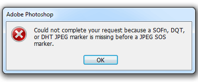
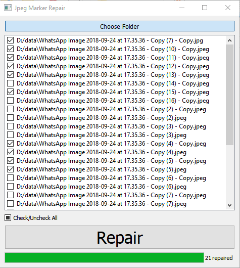

# JPEG Marker Repair
> Repair jpeg images with missing SOFn, DQT, etc. markers.

This little programm was created to solve this error:
> Could not complete your request because of SOFn, DQT or DHT JPEG marker is missing before a JPEG SOS marker



Accordingly to Adobe forums, you need to check for extension of your file, open it in 3rd party program and re-save. It's ok for 1-3 images. But what if you need to fix like 100, 1000 images? That's why I decide to write this simple programm to automate this process.



## Usage example

OS X & Linux:

```sh
coming soon
```

Windows:

```sh
Run executable
Select folder with your images
(Optional) Check broken images / unchek good images
Click Repair button and wait for a few seconds
Done, your images now can be opened in Photoshop
```

## Release History

* 0.2.0
    * ADD: GUI
    * ADD: Support .jpg extension (without "e")
* 0.1.0
    * The first proper release
* 0.0.1
    * Work in progress

## Meta

Distributed under the GNU license. See ``LICENSE`` for more information.

## Tested on
* Windows 10 (64/32 bit)
* Windows 7 (64 bit)

## Download
[](https://github.com/0xSauel/jpeg-marker-repair/releases/download/v2.0.0/Image_Repair_v2.exe)


## Additional information

Code will be added after refactoring.
Programm writed in Python (yes, I didn't change icon).


